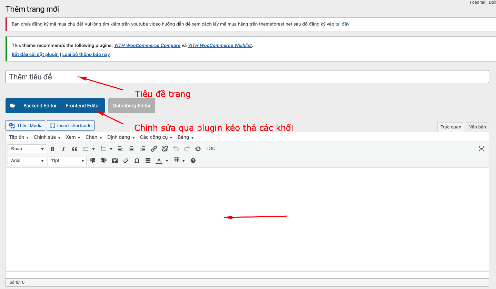

# Thêm Trang

<figure><figcaption></figcaption></figure>

* Thêm tiêu đề
* Nội dung trang
  * Nếu nội dung chỉ có content giống như bài viết thì có thể viết thẳng vào trong&#x20;
  * Nếu muốn thêm các khối khác click vào frontend editor - hướng dẫn:&#x20;
    * [https://wpbakery.com/video-tutorials/](https://wpbakery.com/video-tutorials/)
    * [https://wpbakery.com/video-academy/add-row-column-wpbakery-page-builder-wordpress/](https://wpbakery.com/video-academy/add-row-column-wpbakery-page-builder-wordpress/)


hướng dẫn thêm trang và chỉnh sửa


* Đọc thêm tài liệu bên trên
