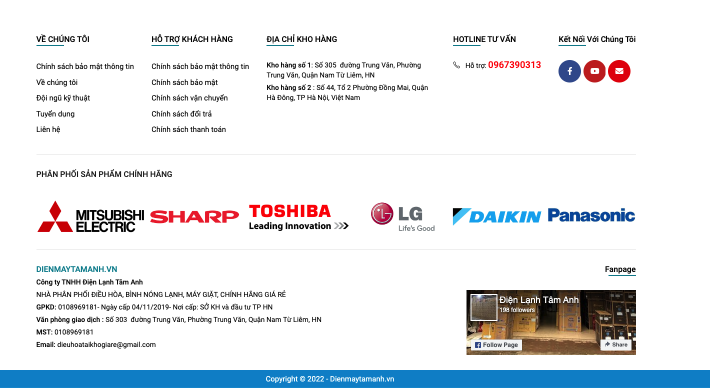

# Footer

Thiết lập footer

<figure><figcaption>
đây là footer
</figcaption></figure>

* Footer layout: Để mặc định
* Footer background: màu nều của toàn footer có thể upload ảnh nền
* Text color : Màu chữ footer
* Text link color: Màu chữ link footer
* Heading color: Màu chữ title footer
* Border color: Màu viền footer
* Copyright background: Màu nền copyright
* Copyright information: Nội dung copyright
