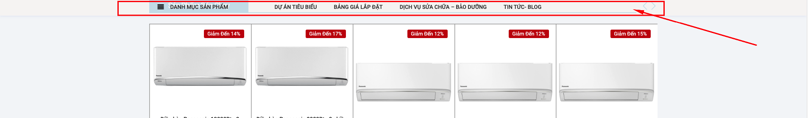

# Main menu

Thiết lập menu chính

* Sticky menu: Khi lăn chuột xuống 1 khoảng cách sẽ show ra sticky menu
*

    <figure><figcaption>
sticky menyu
</figcaption></figure>
* Menu font : Chọn font chữ , màu chữ , độ đậm chữ
* Sticky background color: Màu nền menu sticky
* Sticky menu color: Màu chữ sticky
* Sticky background opacity: Độ mờ màu nền menyu sticky
* Submenu background: Màu nền submenu
* Submenu color: Màu chữ submenu
